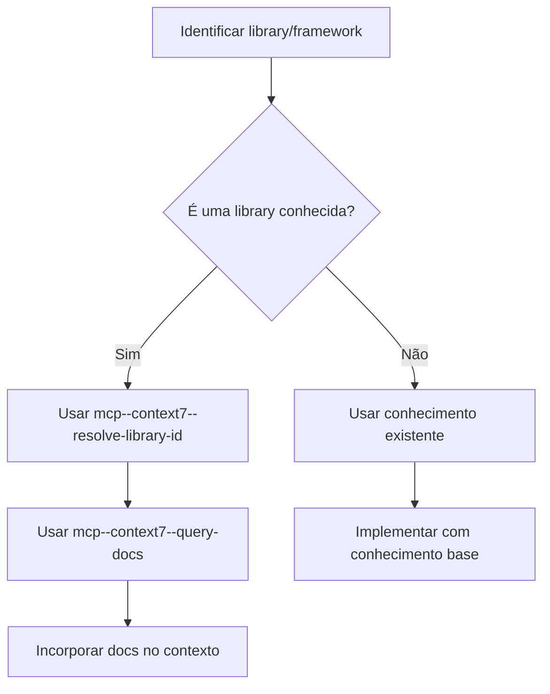

# Documentação e Integração Context7 MCP

## Uso do Context7 MCP

O Context7 MCP fornece acesso a documentações atualizadas de libraries e frameworks. Use-o para obter informações precisas e atualizadas.

### Quando Usar Context7

- Ao trabalhar com libraries ou frameworks desconhecidos
- Quando precisar de exemplos de código para APIs específicas
- Para verificar melhores práticas de implementação
- Ao enfrentar dúvidas sobre configuração ou uso de dependências

### Fluxo de Consulta Context7



### Como Consultar

1. **Identificar a library**: Determine o nome exato da library/framework
2. **Resolver library ID**: Use `mcp--context7--resolve-library-id` para obter o ID
3. **Consultar documentação**: Use `mcp--context7--query-docs` com perguntas específicas

### Exemplo de Uso

```bash
# Primeiro, resolver o library ID
mcp--context7--resolve-library-id(
  libraryName: "supabase",
  query: "How to use Supabase with Swift for iOS authentication"
)

# Depois, consultar documentação específica
mcp--context7--query-docs(
  libraryId: "/supabase/supabase-js",
  query: "How to implement authentication with JWT tokens in Supabase client"
)
```

### Boas Práticas

- **Seja específico**: Pergunte sobre casos de uso específicos, não temas genéricos
- **Verifique a data**: Context7 fornece docs atualizadas; verifique se são recentes
- **Combine fontes**: Use Context7 junto com código existente do projeto
- **Valide exemplos**: Teste código copiado de docs em ambiente de desenvolvimento

### Quando NÃO Usar Context7

- Para código do projeto existente (use `read_file` diretamente)
- Para questões gerais de arquitetura não relacionadas a libraries específicas
- Quando o conhecimento atual é suficiente para a tarefa
