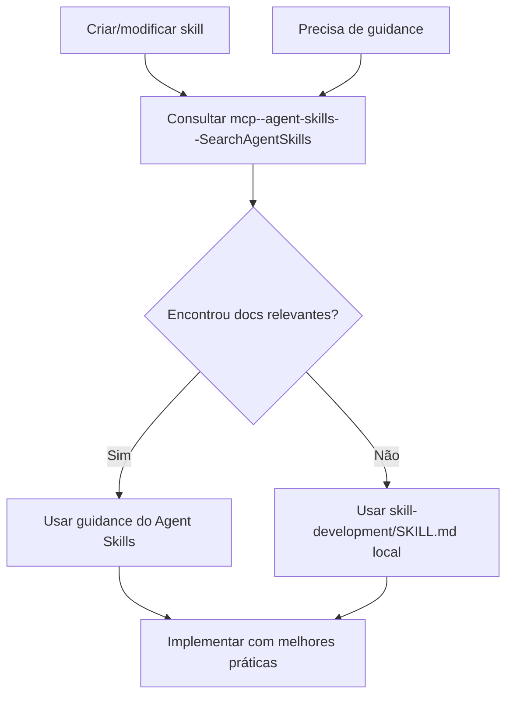

# Skill Development e Integração Agent Skills MCP

## Uso do Agent Skills MCP

O Agent Skills MCP fornece documentação específica para melhores práticas na criação e manutenção de skills para agentes de IA.

### Quando Usar Agent Skills MCP

- Ao criar novas skills para o projeto
- Ao modificar ou melhorar skills existentes
- Ao seguir padrões e convenções de skill development
- Ao estruturar documentação de skills

### Fluxo de Desenvolvimento de Skills



### Como Consultar

Use `mcp--agent-skills--SearchAgentSkills` para encontrar informações relevantes:

```bash
mcp--agent-skills--SearchAgentSkills(
  query: "skill development best practices structure"
)
```

### Princípios de Skill Development

1. **Progressive Disclosure**: Manter SKILL.md lean, mover detalhes para references/
2. **Trigger Phrases**: Usar descrições específicas em third-person no frontmatter
3. **Imperative Form**: Escrever instruções em forma imperativa
4. **Resources**: Incluir scripts/, references/, e assets/ quando apropriado

### Estrutura de Skill Recomendada

```
skill-name/
├── SKILL.md (requerido)
│   ├── YAML frontmatter (name + description)
│   └── Markdown body (core concepts, workflows)
├── references/ (opcional)
│   └── detailed-guide.md
├── scripts/ (opcional)
│   └── validate.sh
└── assets/ (opcional)
    └── templates/
```

### Quando Criar uma Nova Skill

- Quando padrões recorrentes não estão documentados
- Quando conhecimento específico de domínio precisa ser capturado
- Quando múltiplos fluxos de trabalho compartilham estrutura comum

### Quando NÃO Criar uma Nova Skill

- Para conhecimento genérico amplamente disponível
- Para tarefas únicas sem potencial de reuso
- Quando uma skill existente pode ser estendida
